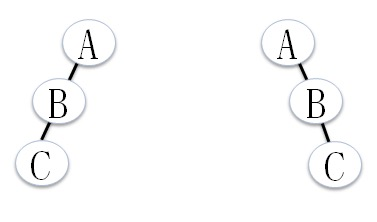

# 项目简介
 该项目是基本数据结构的Java实现，包括：线性表(顺序表和链表)、堆栈、队列、树、图、排序和搜索等。

# 树
前面所说的顺序表、链表(堆栈是其应用)都是线性结构。而树是一种非线性结构，它的应用非常广泛。比如：组织结构、族谱、计算机文件系统等。
树(Tree)是由一个或一个以上节点(Node)组成的，其中有一个特殊节点称为根节点。除了根节点外，树中的所有节点都会有一个父节点。根节点外的每个子集，本身又是一棵树结构。

> 树中的节点直接相互连接，但是不能构成环，如果构成环就不是树了，而是图。

n个互斥的树可以构成森林，比如去除根节点的树，就是一个森林。

关于书的名词：

* 度数(Degree)：每个节点的所有子树个数，称为度。
* 层数(Level)：节点所在树中的第几层，称为层数。根节点为第一层，依次类推。
* 高度(Height)：树中最大层数就是树的高度。
* 叶子节点/终端节点(Terminal Node)：度数为零的节点称为叶子节点。
* 父节点(Parent)：与每个节点所连接的上一层节点，称为该节点的父节点。树中除了根节点以外，都有父节点。
* 子节点(Children)：与每个节点所连接的下一层节点，称为该节点的子节点。
* 祖先(Ancestor)和子孙(Desendent)：从根节点到该节点路径上的所有节点，都称为该节点的祖先节点。从该节点往下追溯子树中的所有节点，都为该节点的子孙节点。
* 兄弟节点(Siblings)：有共同父节点的节点称为兄弟节点。
* 非终端节点：叶子节点以外的节点，都称为非终端节点。
* 同代(Generation)：同一颗树中具有相同层数的节点。

## 二叉树简介
### 为什么会有二叉树？
首先树在计算机中一般是以链表形式存储的，因为树中的度数都不相同，所以我们需要为每个节点准备度数最大的指针个数。这样计算下来对于m个节点最大度数为n的树，需要n\*m地址空间存储，但是除了根节点外，每个节点都会被自己的父节点所指定，所以最多只会用m-1个地址空间。这样空间浪费率为m\*(n-1) + 1/ m * n 得出当度数n为2的时候浪费率为最小的时候，为1/2，所以最常采用的就是二叉树结构。

### 什么是二叉树?
二叉树是由有限节点组成的集合，可以为空集合，或由一个根节点及其左右两个子树组成。二叉树每个节点最多只能有两个子节点，即二叉树的度数最大为2。

二叉树和一般树的区别：

* 树不可为空集合，二叉树可以。
* 树的度数为d>=0，二叉树为0<=d<=2。
* 树的子树没有次序关系，二叉树则有(分左子树和右子树)。

### 二叉树种类
满二叉树：
除最后一层没有任何子节点外，每一层的几点都有两个节点的二叉树，称为满二叉树。满二叉树的高度为h，则节点个数为2^h-1。

完全二叉树：
完全二叉树是从满二叉树而引出来的。如果二叉树的深度为h，则从1~h-1的所有节点度数都为2，第h层的所有节点都集中在最左边，则成为完全二叉树。或者可以这样理解，高度为h，节点个数小于2^h-1，但是节点编号方式和满二叉树一样，从左到右，从上到下的顺序一一对应。

可以看出，满二叉树是完全二叉树的一种。

斜二叉树：
当一个二叉树完全没有左节点或没有右节点，我们就把它成为左斜树或右斜树。

严格二叉树：
二叉树中的所有非叶子节点均有非空的左右子树，称为严格二叉树。

## 二叉树存储
二叉树可以采用数组或链表存储，但是一般会采用链表存储。因为使用数组存储的话，一是空间利用率低，二是对节点进行增删改查会移动大量的元素。

### 数组存储
如果使用数组存储二叉树，则需要把二叉树想象成满二叉树，第k层有2^k-1个节点。然后从根节点开始，从左到右、从上到下，依次存储。入股节点为空则存储也为空，这样可以得出：

* 左子树的索引值是父节点索引值的2\*n。
* 右子树的索引值是父节点索引值的n\*n+1。

### 链表存储
采用链表来存储二叉树的好处在于增加和删除节点相当容易，缺点在于很难找到父节点。除非在每个节点增加一个存储父节点索引的字段。

## 二叉树遍历
二叉树遍历(Binary Threee Traversal)，就是访问树中所有节点各一次，并且将最终结果转化为线性关系。二叉树一般有两种遍历方式：

* 前序遍历：根->左子树->右子树，ABC。
* 中序遍历：左子树->根->右子树，BAC。
* 后续遍历：左子树->根->右子树，BCA。

记忆方法：

* 前中后三种方式对应着根的位置。
* 左子树访问一直在右子树前面。

下面根据下图这颗树来讲解三种遍历方式：

#### 中序遍历
中序遍历的顺序是“左中右”，也就是左子树都访问完成后，访问根节点，然后访问右子树。
上图中中序遍历顺序为：BDCAEHGKF。

实现方法：
1. 实现中序遍历可以借助堆栈，一直访问左子树并将其入栈。
2. 遍历到左子树为空时，开始弹栈，并将其输出。
3. 将弹出节点的右子树作为当前节点，基于重复1、2步骤，直到堆栈为空。

#### 前序遍历
前序遍历的顺序为“中左右”，也就是先从根节点遍历，然后遍历左子树，最后遍历右子树。
上图中前序遍历顺序为：ABCDEFGHK。

实现方法：
和中序遍历实现方式类似，只需要更改一下输出位置即可。
1. 借助堆栈，一直访问左子树并将其入栈，在入栈前将其输出。
2. 直到左子树为空，开始弹栈。
3. 将弹出节点右子树作为当前节点，继续重复1、2步骤，直到堆栈为空。

### 后序遍历
后序遍历的顺序为“左右根”，也就是先访问左子树，然后访问右子树，最后访问根节点。
上图中后续遍历顺序为：DCBHKGFEA。

## 二叉查找树
二叉查找树又称二叉排序树、有序二叉树。有序二叉树是指所有左子树的节点都小于树根的值，所有右子树的节点都大于根节点的值。二叉查找树一般有查找、插入和删除操作。

* 查找节点，只需要根据二叉树的特性来查找即可，如果根节点大于查找值，则遍历左子树，如果根节点小于查找值，则查找右子树，以此顺序循环查找。查找节点是插入和删除节点的前提。
* 根据查找节点方法进行查找，最后如果为空则在为空的位置就是需要插入的值。如果不为空，则说明要插入的值已经在二叉查找树中了。
* 删除节点可以分为三种情况：
    1. 删除叶子节点，只需要将删除节点置为空即可。
    2. 删除有一个子树的节点，只需要使用子树的根节点替换该节点，再将该节点置为空即可。
    3. 删除既有左子树又有右子树的节点，可以把左子树的最大值或右子树的最小值提上来。
    
## 二叉运算树
我们可以将中序表达式按照运算符优先级的顺序构建一颗二叉运算树(Binary Expression Tree，或称二叉表达式树)，之后再按照二叉树的特性进行前中后序遍历，即可得到表达式的前中后缀表达式。
规则：
 1. 表达式运算符的结合性与优先级，再加上适当的括号，叶子节点一定是操作数，内部节点一定是运算符。
 2. 从最内层的括号逐步向外，利用运算符当树根，左边操作数当左子树，右边操作数当右子树。
 
 比如：
 A - B*(-C + -3.5)使用二叉运算树表示：
 
 
 
 ## 二叉线索树
 二叉线索树是一种充分利用树空指针的一个数据结构。正常二叉树2n的指针只会用到n-1个指针，而n+1指针是空闲的。二叉线索树就是将这些空指针指向树的其它节点，这些链接称为线索。
将二叉树转换成线索二叉树步骤：

1. 将二叉树按中序遍历方式排出，然后将有空链接改成线索。比入二叉运算树图中的A，左右链接都为空，所以将其改成线索。
2. 如果左链接为空，则该指针指向中序遍历的前序节点。
3. 如果右链接为空，则将该指针指向中序遍历的后继节点。

二叉线索数一般需要两个额外的指针，来表示左右链接是指针还是线索。

# 图
## 起源
图形理论起源于1736年，瑞士数学家欧拉，为了解决欧尼斯堡的“七桥”问题而想出来的。问题是：是否有人在经过每条桥梁一次的情况下，把所有桥都走过一次并且回到原点。
欧拉最后得出结论：
当所有顶点度数为偶数时，才能从谋顶点触发，经过每条边，再回到原点。这个理论称为欧拉环。
如果经过每条边，不一定回到原点，则只需要其中两个顶点的度数是奇数，其余必须顶点度数必须是偶数，符合这样的结果成为欧拉链。

## 图简介
图是由"顶点"和“边”所组成的集合，通常使用G=(V,E)，其中V表示所有顶点的集合，E表示所有边的集合。图可以分为两种：无向图和有向图。无向图使用(V1,v2)表示边，有向图使用<v1,v2>表示边。

### 无向图
无向图是一种边没有方向的图，也就是(v1,v2)和(v2,v1)代表相同的边。

V = {v1,v2,v3,v4,v5,v6}
E = {(v1,v2),(v1,v3),(v1,v4),(v2,v5),(v3,v4),(v3,v5),(v3,v6),(v4,v6),(v5,v6)}

无向图相关术语：

无向完全图：在无向图中，n个顶点恰好有n(n-1)/2条边，称为无向完全图。
路径：两个顶点之间经过边的集合称为两个顶点的路径。
简单路径：除了起点和终点外，其它经过的顶点都不相同，称为简单路径。

# 排序
数据结构中最常见且最重要的数据结构就是排序和查找了。排序是指将一组数据按照一定规则调换位置，使数据具有某种顺序(递增或递减)。
排序过程中，数据的移动方式可分为直接移动和逻辑移动。直接移动是指直接交换存储的位置。逻辑移动是指只需要改变数据指针的指向的位置即可。
排序的优点：

 * 便于数据查看。
 * 便于数据统计和整理。
 * 可大幅减少数据查找时间。 

## 排序分类
排序按照执行时所使用的内存种类可以分为内部排序和外部排序两种：

* 内部排序：排序数据量小，可以全部加载到内存中进行排序。
* 外部排序：排序数据量大，无法一次全部加载到内存中进行排序，需要借助外部存储器进行排序。

常见的排序算法有八种：冒泡排序、选择排序、插入排序、合并排序、快速排序、堆排序、希尔排序和基数排序。

按照数据排序过程中的排序方式不同可以分为以几大类：

* 交换类排序：冒泡排序、快速排序。
* 选择类排序：选择排序、堆排序。
* 插入类排序：插入排序、希尔排序。
* 归并排序。
* 基数排序。

## 排序算法分析方式
排序算法选择的好坏将直接影响到排序的结果和效率。所以要根据排序场景，选择适合的排序算法。我们可以通过以下几种分析方式，对排序算法进行分析。

### 算法的稳定性
稳定性是指讲过排序后，具有相同值记录的序列是否保持不变。比如说A1、B1、A2，排序后序列为A1、A2、B1，经过排序后A1、A2(它们的值相同)的相对顺序不变。

### 时间复杂度
当数据量较大时，排序算法所花费的时间就显得非常重要。排序算法的时间复杂度可以为：最好情况、最坏情况和平均情况。

* 最好情况是指序列已经排好序。比如原本序列就是升序，如果在进行一次升序排序，那么所使用的时间复杂度就是最好情况。
* 最坏情况是指序列中每个值都需要重新排序。比如原本是升序，现在需要降序，这种情况是排序的最坏情况。

### 空间复杂度
空间复杂度是指算法执行过程中所需占用的额外空间。比如递归需要借助堆栈，堆栈就是所付出的额外空间。另外，任何算法在交换数据时，都会借助一个额外的空间也需要考虑进去。

## 交换类排序
交换排序思想是：两两比较序列中的记录，如果不满足需求，则交换他们的位置，直到全部有序。

### 冒泡排序
冒泡排序是从观察水中气泡变化而构思出来的。它的原理是从第一个元素开始，比较相邻的两个元素，如果顺序不符合，则进行对调，然后再与下一个元素进行比较，整个过程仿佛气泡从水底升到对面一样。经过一次扫描后，可以确保最后一个元素位于正确的位置，接着进行第二次扫描，知道所有元素排完序为止。

算法实现原理：

1. 从数据中第一个数开始，一次与相邻数比较，如果不满足要求，则交换位置，直到最后无序数字。
2. 每一轮冒泡排序后，最大数字都将移动到最后。

算法实现可查看：BubbleSort.java

算法分析：

1. 冒泡排序是比较相邻两个元素，并不会改变原本序列的顺序，所以是稳定排序。
2. 最坏情况需比较(n-1) + (n-2) + ... + 3 + 2 + 1=n(n-1)/2，时间复杂度为O(n^2)。最好情况扫描一次发现没有数据交换操作，所以只做了(n-1)次比较，时间复杂度为O(n)。平均时间复杂度为O(n^2)。
3. 只需要一个额外空间，所以空间复杂度最佳O(1)。

总结：冒泡排序适应于数据量少或部分数据有序的情况。

### 快速排序
冒泡排序是将两个相邻的元素进行比较和交换，每次交换只能上移或下移一个元素，导致总的比较和移动次数比较多。快速排序又称为分区排序，是冒泡排序的改进，快速排序采用的分而治之思想。它会首先选择一个虚拟的中间值作为分区标准，序列中小于该值的放左边，大于该值的放右边，在以相同的方式分别处理左右子序列数据，直到排序完成。

算法实现原理：

1. 从带分区的序列中选择一个值作为分区标准，一般选择第一个值。
2. 把所有小于该值的移到左边，大于该值的记录移到右边，中间放所选记录。这个过程为一次排序。
3. 对前后两个子序列重复1，2步骤，知道所有记录排好序。

算法实现可查看：QuickSort.java

算法分析：

1. 快速排序不是稳定排序，因为每次都是从最左或最右移动到另一端。 
2. 最好情况时间复杂度为O(nlog2n)，最坏情况是每次挑选的分区值不是最大值就是最小值(比如对已经排好序的序列进行排序)，这时候时间复杂度为O(n^2)，平均时间复杂度为O(nlogn)。
3. 最差情况下空间复杂度为O(n)，最佳情况为O(log2n)。

总结： 快速排序是平均运行时间最快的排序算法。快速排序的效率受基准点选择的影响，一般基准点可以通过固定切分、随机切分和三数取中切分。三数取中是最理想的状况，它的思想是每次选择出最左、最右、中间三个值进行排序，然后选择中间值作为基准值。

## 插入类排序
插入排序的基本思想是：每次将待排序记录中的最大值或最小值，插入到已经排好序的序列中，直到将全部序列插入完成。

### 直接插入排序
插入排序是将数组中元素逐一与已经排好序的数据进行比较，第二个元素与第一个元素进行比较，如果不符合排序要求，将第一个元素移动到第二个位置，接着第三个元素与前两个元素进行比较，不满足需求的向后移动，一直找到合适的位置(前一个元素比插入之小，后一个元素比插入值大)。一直循环上面的步骤，直到整个序列元素全部有序。

算法实现原理：

1. 使用一层循环来确定插入次数，从第二个元素开始一直到数组结尾。
2. 里层循环将待插入数据与已经排好序的序列进行比较，如果不满足排序要求，将元素向后移动，一直找到适合该元素的位置(前一个值小于该元素，后一个值大于该元素)
3. 循环第二步，一直到所有元素有序。

算法实现可查看：InsertSort.java

算法分析：

1. 直接插入排序属于稳定排序。
2. 时间复杂度O(n)到O(n^2)，平均时间复杂度为O(n^2)。
3. 只需要一个额外的存储空间，空间复杂度最佳。

总结：直接插入排序适合大部分数据已经排好序，后者新增数据到已经排好序的序列中。插入排序会造成大量空间移动，所以最好在链表上使用。

### 希尔排序
我们知道当原始序列基本有序的情况下，插入排序非常高效，因为不需要执行太多的数据迁移工作。希尔排序是对直接插入排序的一种改进，它又称为缩小增量排序。它把相邻指定距离(步长)的元素进行比较，并且不断把步长缩小至1，完成排序。
希尔排序开始时步长比较大，分组比较多，但是每组记录比较少，所以采用直接插入排序较快。随着步长的变小，分组数减少，各组的记录增多，但是每组的元素已经基本有序，所以新的一趟排序不需要移动大量位置。

算法实现原理：
1. 以序列长度的一半作为起始步长，然后对逐一对元素使用该步长进行排序。
2. 以步长分隔的元素作为一个分区序列，然后使用插入排序对该序列进行排序。
3. 将该步长减少一半。
4. 循环上面过程，直到步长为1，也就是直接插入排序的过程。

算法实现可查看：ShellSort.java

算法分析：

1. 属于不稳定排序算法。
2. 时间复杂度为O(n^3/2)。
3. 只需要一个额外空间，空间复杂度最佳。

总结：此排序算法适用于序列基本有序的排序。

## 选择排序
选择排序的基本思路是：每次从待排记录中选择最小或最大的记录，顺序放在已经排好序的序列后后面，直到全部排好序。

### 简单选择排序
从原始记录中选出最小值或最大值(降序)与第一个元素进行位置交换，然后从剩下的记录中选择最小值或最大值与第二个元素交换，循环到只剩下一个元素为止。

算法实现原理：

1. 使用一层循环来保证每个元素都进行选择排序。
2. 内层循环进行记录比较，选择出最小值或最大值。
3. 将正在进行选择排序的记录与最小值或最大值进行位置交换。
4. 循环上面三个步骤，直到外层循环遍历完。

算法实现可以查看：Selectsort.java

算法分析：

1. 属于不稳定排序算法。
2. 时间复杂度为O(n^2)。
3. 只需要一个额外空间，所以空间复杂度最佳。

### 堆排序
堆排序是简单选择排序的一种改进。简单选择排序比较n-1个元素后序并没有记录之前的比较结果，只是选出最小或最大元素，当到下一个元素的时候，又开始从头到尾进行比较，进行了很冲重复比较。
堆排序是借助完全二叉树来进行排序的，堆排序分为大根堆和小根堆。
大根堆：
1. 父节点存储的是不小于子节点的值，左右子节点没有顺序。
2. 根节点是所有节点中的最大值。

小根堆与其相反，根节点是最小值，小根堆是进行降序排序构建的。

堆排序的序列一般使用数组进行存储，i节点的父节点下标为(i-1)/2。它的左右子节点下标分别为2\*i+1和2\*i+2。

算法实现思路(大根堆)：
1. 从最后一个元素开始找它的父节点，然后父节点与左右孩子比较，如果孩子节点中的最大值比父节点大，则交换位置。
2. 跟子节点交换位置后，对子节点重复1步骤比较。保证大根堆的规则。
3. 一次排序找出根之后与尾节点交换位置，然后重复上面步骤。

算法实现可参考：HeapSort.java

算法分析：

1. 不稳定排序。
2. 时间复杂度为O(nlogn)。
3. 空间复杂度只需要一个额外空间，所以为O(1)

