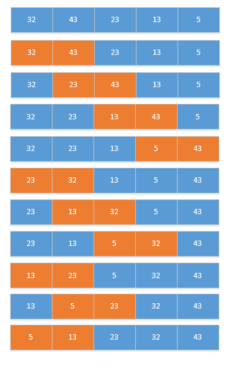
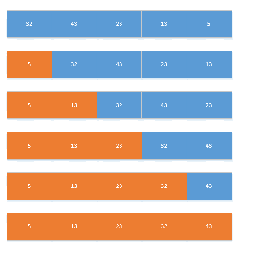

# 项目简介
 该项目是基本数据结构的Java实现，包括：线性表(顺序表和链表)、堆栈、队列、树、图、排序和搜索等。

# 数据结构介绍
## 数据结构定义
数据结构就是计算机中组织和存储数据的特定形式，它使得数据处理更加高效。一种数据结构就是一种组织和存储数据的特定形式。常用的数据结构有：数组(顺序表)、链表、栈、队列、树和图等。
根据元素的组织方式，数据结构可以分为两种类型：线性结构和非线性结构。线性结构是指按照线性次序访问元素，但并不强制所有元素连续的存储，比如链表、栈、队列等。非线性结构是指以非线性次序来存储和访问元素，比如树和图等。

## ADT
抽象数据类型是指将数据结构和对数据相关运算组合起来，称为抽象数据类型。一个ADT包括以下两部分：
* 数据的声明。
* 运算的声明。

定义ADT时不需要考虑具体实现细节，这些实现细节可以在使用它们时在考虑具体的实现。

## 算法
算法就是用一条接一条的指令来解决特定的问题。对于一个给定的问题，我们只需要通过一步一步的过程来解决它。

对于一个问题可能存在多种算法解决方式，通过算法分析能够帮助我们了解在时间开销和空间开销上哪一种算法更加高效。算法分析的两个主要目标就是时间和空间，但是随着计算机硬件的发展和对软件响应的要求迫切，一般我们多是主要分析算法的时间开销，称之为时间复杂度。
一种理想的算法比较方式就是通过一个函数f(n)来表示一个算法时间复杂度，该参数的输入参数就是要解决的问题规模。我们通过比较这些不同函数所对应的时间，来比较不同算法的优劣(这种比较方式和本地机器和编程风格都无关)。
对于函数f(n),随着问题规模的增长，我们会忽略那些相对微不足道的低阶因变量，比如```2+3n+2n^2+3n^3约等于n^3```，所以它的时间复杂度就是O(n^3)。
算法分析一般分为三种情况：
* 最好情况：定义算法最短的运行时间输入，这种输入使得算法运行最快。
* 最坏情况：定义算法最长的运行时间输入，这种输入使得算法运行最慢。
* 平均情况：提供算法运行时间的预测值。
而上面的O表示法(O(n^3))，就是分析算法的最坏情况，这也是我们分析算法主要情况。这种分析也称为渐进分析法。

# 递归和回溯
数据结构中经常用到的两个算法求解方式就是递归和回溯，所以看数据结构之前，我们可以先了解一下递归和回溯。

## 递归
任何调用自身的函数称之为递归。递归是通过调用自身去解决一个比原始规模更小一些的问题，这个过程称之为递归步骤。递归会导致更多递归的产生，所以保证递归能够停止很重要。
之所以采用递归是因为，递归代码相较于迭代代码更加简洁。
递归一般由两个重要组成部分：
* 递归条件，在什么情况下继续进行递归调用。
* 递归终止条件，用于退出本次递归条件。

比如阶乘n!，求解n!的过程其实就是求解n*(n-1)!的过程，而当分解到n=1时1的阶乘就为1本身，所以当n=1时其实就是递归终止条件。
```$java
int fact(int n){
    if(n == 1)
        return 1;   //递归终止条件
    else if(n == 0)
        return 0;   //递归终止条件
    else 
        n * fact(n-1); //继续调用递归的条件
}

```

递归的过程其实就是在内存生成一个新的函数副本，一旦函数结束，该函数的副本就会从内存中删除。所以可以看得出来，递归其实会更加消耗内存。

一般递归问题都可以通过迭代来解决，我们来比较一下递归和迭代。
递归特点：
* 通过采用递归方式求解，可以将大问题转化为小问题。
* 每次递归都需要使用额外的存储空间来存储栈帧(函数副本)，容易产生堆栈溢出。
* 代码简介，可读性高。
迭代特点：
* 不需要额外的存储空间，所以空间上没有多于开销。
* 运行效率高，因为递归需要有函数调用的开销。
* 编写代码困难，并且代码相对不容易理解。

## 递归应用
### 汉诺塔问题
问题描述：https://zh.wikipedia.org/wiki/%E6%B1%89%E8%AF%BA%E5%A1%94
算法：
1. 将源柱上面n-1个圆盘移动到辅助柱上。
2. 将源柱上面的第n个盘子移动到目标柱上。
3. 将辅助柱上面的n-1个盘子移动到目标柱上。
4. 将源柱上面的n-1个盘子移动到辅助柱上面，又可以认为是一个新问题，并以同样的方式解决。

```$java
void towerOfHanoi(int n,char fromPeg,char toPeg,char auxPeg) {
    //如果只有一个圆盘则直接将其从源柱移动到目标柱上面
    if(n == 1) {
        System.out.println("move " + n + " from " + fromPeg + " to " + toPeg);
        return;
    }
    //将n-1个圆盘移动到辅助柱上面
    towerOfHanoi(n-1,fromPeg,auxPeg,toPeg);
    //将第n个源码移动到目标柱上面
    System.out.println("move " + n + " from " + fromPeg + " to " + toPeg);
    //将辅助柱上面的圆盘移动到目标柱上面
    towerOfHanoi(n-1,auxPeg,toPeg,fromPeg);
}
```

### 判断一个数组是否有序
从数组开头或结尾位置开始向前比较，如果发现顺序不对则直接返回。注意从头开始递归和从尾开始递归的终止条件正好相反。
```$java
//初始index为数组长度-1
int arrayIsSort(int[] array,int index) {
    //如果遍历到只剩下一个元素，则说明整体有序
    if(index == 0 || index == 1) {
        return 1;
    }
    //如果不满足排序需求，直接返回0。否则继续向前比较
    return array[index-1] > array[index] ? 0 : arrayIsSort(array,index-1); 
}
```
关于递归完整代码可以查看：https://github.com/datayjz/data-structure-java/blob/master/src/com/yjz/datastructure/recursion/RecursionDemo.java


## 回溯法
TODO


# 线性表

线性表是一种相当简单和基本的数据结构，它是含有n个类型相同元素的有限序列(n>=0)。线性表可以看成是一种有序对的集合，目的在于表示线性表中两个相邻元素之间的关系。可以表示成(a1,a2,…,an-1,an)，其中ai-1称为ai现行元素，ai称为ai-1可的后继元素，除了第一个元素没有现行元素，最后一个没有后继元素，其它所有元素都唯一的先行元素和后继元素。

## 线性表的存储结构
线性表在计算机中的存储结构可以分为两类：静态数据结构和动态数据结构。

### 静态数据结构
也称为顺序表、密集表，它是使用连续的内存空间来存储顺序表中的数据。静态数据结构在编译的时候就给相关变量分配好内存空间了。由于顺序表的存储特性，我们读取和修改任意一个元素的时间都是固定的。但同时如果删除或加入元素是，需要移动的大量的数据，并且线性表容易造成内存的浪费。在编程语言中有许多顺序表的应用，比如数组。

### 动态数据结构
动态存储结构，又称为链表，它使用不连续的内存空间存储线性表中的数据。它的优势在于插入或删除元素时相当方便，不需移动大量数据。但是在查找和修改数据时，无法向静态数据结构那样随机读取，必须遍历。动态数据结构还有另外一个优点，就是在程序执行时才进行内存分配，可以避免内存浪费。

## 顺序表
数组是顺序表的一种应用，数组名称表示一块紧密相邻的内存起始位置，索引表示从内存起始位置的第几个区块。数组可以分为一维、二维和多维数组，其原理都是一样的，二维数组是一维数组中的数组。
数组在不同语言的存储方式可以分为为：以行为主存储和以列为主存储。

具体实现可以查看：
顺序表数组实现完整代码：https://github.com/datayjz/data-structure-java/blob/master/src/com/yjz/datastructure/linearlist/ArrayList.java

## 链表
链表是线性表采用动态存储结构的数据结构，链表的特性是各个数据项在计算机内存中是不连续且随机的存放的，优点就是加入和删除数据不需要移动大量的数据，并且当单个数据被删除后能够将内存空间释放。

链表可以分为单向列表、双向列表和循环列表。

### 单向列表
单向列表由两个元素组成：数据和指向下一个节点的指针。单向列表中第一个节点称为“表头”，最后一个节点称为“表尾”，最后一个节点的指针为null，因为没有下游节点了。


单链表实现完整代码：https://github.com/datayjz/data-structure-java/blob/master/src/com/yjz/datastructure/linearlist/SingleLinkedList.java

通过创建内部类来创建链表节点数据结构，优点是可以和外部类进行私有操作的互相访问。

### 循环链表
循环链表是在单向链表的基础上，将尾节点指向链表的头部而不是null，这样这个那个链表就形成了一个单方向的环形结构。循环链表的有点是可以从任何节点来遍历。


遍历一个循环列表，只需要判断节点的下游是不是head就可以了，其它操作其实和单向列表没有多大差别。
```
Node<E> tmpNode = head;
while(tmpNode.next != head){
    tmpNode = tmpNode.next;
}
```
循环链表具体实现可查看：https://github.com/datayjz/data-structure-java/blob/master/src/com/yjz/datastructure/linearlist/LoopLinkedList.java

### 双向链表
单向链表只能够进行单向遍历，如果其中一个节点断开，就会导致后续链表数据丢失。而双向链表是每个节点都有两个指针，分别指向该节点的前驱和后继。双向链表可以是循环双向链表也可以不是，如果尾节点的后继指针指向头节点，而头节点的前驱指针指向尾节点就会形成一个双向循环链表。


Java的LinkedList就是一个双向链表。

双向链表具体实现可以查看:https://github.com/datayjz/data-structure-java/blob/master/src/com/yjz/datastructure/linearlist/DoubleLinkedList.java

# 堆栈
堆栈(Stack)是一组具有相同类型数据的集合，具有后进先出的特性，所有操作均在顶端进行。
堆栈是一种抽象的数据类型，它的特性是：
 1. 只能从堆栈的顶端存储数据。
 2. 数据存储符合后进先出的特性。

堆栈的基本操作包括：create(创建堆栈)、push(把数据压入栈的顶端)、pop(从栈顶弹出元素)、isEmpty(判断堆栈是否为空)、full(判断堆栈是否已满)。

## 堆栈的应用
堆栈在计算领域应用非常广泛，主要是利用的堆栈数据插入和删除元素的位置和方法。
比如：二叉树遍历、CPU中断处理、图的深度优先搜索、递归、算术表达式转换和求和、调用子程序等。

## 堆栈实现
* 堆栈有两种实现方式：使用顺序表实现堆栈和使用链表实现堆栈。顺序表实现堆栈可以使用数组简单实现，但是顺序表实现堆栈需要事先声明大小，不太灵活。使用链表实现堆栈最大的优点就是可以动态改变链表的长度，能有效利用内存资源。
* 数组实现堆栈完整代码可以查看：https://github.com/datayjz/data-structure-java/blob/master/src/com/yjz/datastructure/stack/SequenceStack.java
* 链表实现堆栈完整代码可以查看：https://github.com/datayjz/data-structure-java/blob/master/src/com/yjz/datastructure/stack/LinkedStack.java

# 队列
队列是一种先进先出(First In First Out,FIFO)的数据结构，和堆栈一样是一种线性表的抽象数据结构类型(ADT)。
堆栈只需要一个top指针，而队列需要front和rear两个指针，分别对应队头元素和队尾元素。
队列具有下面两个特性：
 * 先进先出(FIFO)的特性。
 * 拥有两种基本操作，即加入和删除，而且使用front和rear两个指针分别指向队头和队尾。

队列基本操作：创建队列、队尾添加元素、队头取出元素、返回队列前端值，队列是否为空。

* 数组实现队列完整代码可以查看：https://github.com/datayjz/data-structure-java/blob/master/src/com/yjz/datastructure/queue/ArrayQueue.java
* 数组实现循环队列完整代码可以查看：https://github.com/datayjz/data-structure-java/blob/master/src/com/yjz/datastructure/queue/LoopArrayQueue.java
* 链表实现队列完整代码可以查看：https://github.com/datayjz/data-structure-java/blob/master/src/com/yjz/datastructure/queue/LinkedQueue.java


# 树
## 什么是树结构
前面所说的顺序表、链表(堆栈是其应用)都是线性结构。而树是一种非线性结构，它的应用非常广泛。比如：组织结构、族谱、计算机文件系统等。
树(Tree)是由一个或一个以上节点(Node)组成的，其中有一个特殊节点称为根节点。除了根节点外，树中的所有节点都会有一个父节点。根节点外的每个子集，本身又是一棵树结构。


> 树中的节点直接相互连接，但是不能构成环，如果构成环就不是树了，而是图。

n个互斥的树可以构成森林，比如去除根节点的树，就是一个森林。

关于树的名词：

* 度数(Degree)：每个节点的所有子树个数，称为度。
* 层数(Level)：节点所在树中的第几层，称为层数。根节点为第一层，以此类推。
* 高度(Height)：树中最大层数就是树的高度。
* 叶子节点/终端节点(Terminal Node)：度数为零的节点称为叶子节点。
* 父节点(Parent)：与每个节点所连接的上一层节点，称为该节点的父节点。树中除了根节点以外，都有父节点。
* 子节点(Children)：与每个节点所连接的下一层节点，称为该节点的子节点。
* 祖先(Ancestor)和子孙(Desendent)：从根节点到该节点路径上的所有节点，都称为该节点的祖先节点。从该节点往下追溯子树中的所有节点，都为该节点的子孙节点。
* 兄弟节点(Siblings)：有共同父节点的节点称为兄弟节点。
* 非终端节点：叶子节点以外的节点，都称为非终端节点。
* 同代(Generation)：同一颗树中具有相同层数的节点。

## 二叉树介绍
如果一棵树中的每个节点只有0、1或2个孩子节点，那么这棵树就称为二叉树。二叉树可以看成由根节点和两棵不相较的子二叉树组成，这两棵子树分别称为左子树和右子树。空树也是一种有效的二叉树。


### 二叉树种类
二叉树根据孩子节点个数可以分为：严格二叉树、满二叉树和完全二叉树。

严格二叉树：是指二叉树中所有节点要么有两个孩子节点，要么没有孩子节点。


满二叉树：是指二叉树中除去叶子节点，每个节点都有两个孩子节点，并且所有叶子节点都在同一层。满二叉树的高度为h，则节点个数为2^h-1。


完全二叉树：完全二叉树是从满二叉树而引出来的。如果二叉树的深度为h，则从1~h-1的所有节点度数都为2，第h层的所有节点都集中在最左边，则成为完全二叉树。或者可以这样理解，高度为h，节点个数小于2^h-1，但是节点编号方式和满二叉树一样，从左到右，从上到下的顺序一一对应。


斜二叉树：当一个二叉树完全没有左节点或没有右节点，我们就把它成为左斜树或右斜树。


### 为什么会有二叉树？
首先树在计算机中一般是以链表形式存储的，因为树中的度数都不相同，所以我们需要为每个节点准备度数最大的指针个数。这样计算下来对于m个节点最大度数为n的树，需要n\*m地址空间存储，但是除了根节点外，每个节点都会被自己的父节点所指定，所以最多只会用m-1个地址空间。这样空间浪费率为m\*(n-1) + 1/ m * n 得出当度数n为2的时候浪费率为最小的时候，为1/2，所以最常采用的就是二叉树结构。


二叉树和一般树的区别：

* 树不可为空集合，二叉树可以。
* 树的度数为d>=0，二叉树为0<=d<=2。
* 树的子树没有次序关系，二叉树则有(分左子树和右子树)。


## 二叉树存储
二叉树可以采用数组或链表存储，但是一般会采用链表存储。因为使用数组存储的话，一是空间利用率低，二是对节点进行增删改查会移动大量的元素。

### 数组存储
如果使用数组存储二叉树，则需要把二叉树想象成满二叉树，第k层有2^k-1个节点。然后从根节点开始，从左到右、从上到下，依次存储。如果节点为空则存储也为空，这样可以得出：

* 左子树的索引值是父节点索引值的2\*n。
* 右子树的索引值是父节点索引值的2\*n+1。

### 链表存储
采用链表来存储二叉树的好处在于增加和删除节点相当容易，缺点在于很难找到父节点。除非在每个节点增加一个存储父节点索引的字段。

```java
//假设存储节点数据为int类型
public class BinaryTreeNode{
    public int data;
    public BinaryTreeNode left;
    public BinaryTreeNode right;
    
    public BinaryTreeNode(BinaryTreeNode left,int data,BinaryTreeNode right) {
        this.left = left;
        this.data = data;
        this.right = right;
    }
}
```
二叉树的基本操作可以查看:https://github.com/datayjz/data-structure-java/blob/master/src/com/yjz/datastructure/tree/BinaryTree.java

## 二叉树遍历
二叉树遍历(Binary Threee Traversal)，就是访问树中所有节点各一次，并且将最终结果转化为线性关系。二叉树一般有四种遍历方式：


根据实体节点的处理顺序可以分为三类：
* 前序遍历：根->左子树->右子树，ABC。
* 中序遍历：左子树->根->右子树，BAC。
* 后续遍历：左子树->右子树->根，BCA。

除了根据实体访问顺序外，我们还可以使用一种不依赖顺序的遍历方式：层次遍历，这种是受图的广度有限遍历算法得到启发而来。

记忆方法：

* 前中后三种方式对应着根的位置。
* 左子树访问一直在右子树前面。

下面根据下图这颗树来讲解三种遍历方式：


#### 前序遍历
前序遍历的顺序为“中左右”，也就是先从根节点遍历，然后遍历左子树，最后遍历右子树。
上图中前序遍历顺序为：ABCDEFGHK。

我们可以看到前序遍历完左子树后，还需要遍历根的右子树，所以需要保留根信息。使用栈能够轻松解决这种问题，因为栈本身就具有LIFO的特点。

实现方法：
1. 处理当前节点。
2. 将当前节点入栈，以便之后用来遍历右子树。
3. 遍历当前节点的左子树。
4. 当左子树为空时，开始将子树根节点弹栈。
5. 开始遍历当前根节点的右子树。

前序遍历完整实现可以查看：


#### 中序遍历
中序遍历的顺序是“左中右”，也就是左子树都访问完成后，访问根节点，然后访问右子树。
上图中中序遍历顺序为：BDCAEHGKF。

实现方法：
中序遍历方法和前序类似，只不过是先处理左子树，然后处理根节点。
1. 将当前根节点入栈。
2. 然后一直遍历左子树，直到其为null。
3. 当左子树为空时，弹出根节点执行相应操作。
4. 最后在遍历右子树，直到其为空或栈为空。

中序遍历完整实现可以查看：


### 后序遍历
后序遍历的顺序为“左右根”，也就是先访问左子树，然后访问右子树，最后访问根节点。
上图中后续遍历顺序为：DCBHKGFEA。

实现方法：
对于前中序遍历，当访问完节点后就不需要使用了。而对于后序遍历，每个节点要访问两次，因为在遍历完左节点后需要访问根节点，找到对应的右节点，而遍历完右节点后，才是真正访问该节点。
解决这个问题可以通过判断当前出栈节点的右节点是否和当前节点一样，如果一样则说明右子树访问完了，这次可以直接出栈使用了。

后序遍历完整实现可以查看：
 

### 层序遍历
层序遍历可以借助队列来完成，当访问当前节点时将当前节点的左右子树入队，以次循环遍历。

层序遍历完整实现可以查看： 

## 二叉树应用实例
二叉树中大部分应用都可以借助树的遍历完成，一般有两种解决方案：递归和非递归。
比如使用递归和非递归实现查找二叉树中最大元素，可以查看 实现。

## 二叉查找树
二叉查找树又称二叉排序树、二叉搜索树。二叉搜索树是指所有左子树的节点都小于树根的值，所有右子树的节点都大于根节点的值。
在没有二叉搜索树之前，查找树元素的时间复杂度为O(n)，也就是需要遍历所有节点。而使用二叉搜索树，由于数据的有序性，搜索数据时间复杂度为O(logn)
二叉查找树的主要操作为：查找、插入和删除操作。

* 查找节点，只需要根据二叉树的特性来查找即可，如果根节点大于查找值，则遍历左子树，如果根节点小于查找值，则查找右子树，以此顺序循环查找。查找节点是插入和删除节点的前提。
* 插入节点：根据查找节点方法进行查找，最后如果为空则在为空的位置就是需要插入的值。如果不为空，则说明要插入的值已经在二叉查找树中了。
* 删除节点可以分为三种情况：
    1. 删除叶子节点，只需要将删除节点置为空即可。
    2. 删除有一个子树的节点，只需要使用子树的根节点替换该节点，再将该节点置为空即可。
    3. 删除既有左子树又有右子树的节点，可以把左子树的最大值或右子树的最小值与之替换。因为这两类节点最多只有一个孩子节点，这样再删除该节点时就和1、2步一样了。
    
由于二叉树的特性，当我们通过中序遍历二叉查找树时，会得到一个有序序列。


二叉查找树的完整实现可以查看：https://github.com/datayjz/data-structure-java/blob/master/src/com/yjz/datastructure/tree/BinarySearchTree.java

> 二叉搜索树在为斜树的时候，时间复杂度为O(n)。为了针对这种情况，可以将其转换为平衡二叉搜索树，平衡二叉搜索树的左右子树高度差为0(HB(0)表示，0为平衡因子)。

## AVL树(AVL-tree)
上面说的完全平衡二叉树，如果HK(k)的平衡因子为为1，那么这棵二叉搜索树就叫做AVL树。
AVL树具有以下特点：
* 它是一棵二叉搜索树。
* 对于二叉搜索树中的任意一个节点，它的左右子树高度差最多都不超过1。

下图左侧不是AVL树，右侧的二叉搜索树为AVL树：


当对AVL-tree不符合规则时，也就是说对于一节点存在左右子树高度差大于1。这时候就需要通过对树进行旋转，使其重新变为AVL-Tree。
假设该最深节点为X，由于节点最多拥有两个子节点，而所谓“平衡被破坏”意味着X的左右两棵子树的高度相差2，因此我们可以轻易将情况分为四种：
1. 插入节点位于X的左子节点的左子树，即左左。
2. 插入节点位于X的左子节点的右子树，即左右。
3. 插入节点位于X的右子节点的左子树，即右左。
4. 插入节点位于X的右子节点的左子树，即右右。

针对1、4情况可以通过一次旋转即可使其维持平衡，而对于2、4则需要两次旋转才可以维持平衡。           

左左或右右情况直接旋转平衡：


左右或右左先对子树旋转，再对父节点旋转：


## 红黑树(RB-Tree)
红黑树是一种特殊的二叉搜索树，红黑树中的每个节点都增加了一个存储位，表示该节点是Red或Black。通过这种对节点着色的方式，可以确保不会存在任何一条路径高出其它路径2倍，进而接近平衡。

红黑树能够保证插入、删除、查找节点的时间复杂度最坏为O(logn)，效率非常高。
红黑树具有五个特点：
1. 每个节点要么是红色，要么是黑色。
2. 根节点为黑色。
3. 每个叶子节点为黑色(这里的叶子是指为null的节点)
4. 一个节点如果为红色，那么它的子节点必然是黑色。
5. 对于任意节点，到叶子节点的任意路径都包含相同数量的黑节点。


### 红黑树用途
红黑树由于其出色的性能，应用非常广泛。比如Java中的TreeMap、Linux的虚拟内存管理等等。

### 红黑树的基本操作
红黑树和AVL树的操作类似，当增加或删除节点时会导致其不符合对应的规则，这时候就需要对它进行旋转，使其重新平衡。

插入节点过程：
1. 按照二叉查找树的规则插入节点。
2. 将插入节点着色为红色，因为这样可以至少保证不会违背5条规则中的第五条。
3. 将其进行旋转，使其满足红黑树规则。

删除节点过程：
1. 将红黑树当做二叉查找树，将节点删除。
2. 通过旋转和重新着色，其实重新成为一棵红黑树。


## 二叉线索树
二叉线索树是一种充分利用树空指针的一个数据结构。正常二叉树2n的指针只会用到n-1个指针，而n+1指针是空闲的。二叉线索树就是将这些空指针指向树的其它节点，这些链接称为线索。
二叉线索树还需要在节点添加两个标记位，来判断当前左右指针是指向孩子节点还是前序或后继节点(前中后序的后继节点)。

```java
public class Node{
    public Node left;
    public Node right;
    public int data;
    public int rTag;//如果为1则说明right指向右孩子节点，如果为0则说明指向后继节点。
    public int lTag;
}
```

将二叉树转换成线索二叉树步骤(中序遍历)：

1. 将二叉树按中序遍历方式排出，然后将有空链接改成线索。比如二叉运算树图中的A，左右链接都为空，所以将其改成线索。
2. 如果左链接为空，则该指针指向中序遍历的前序节点。
3. 如果右链接为空，则将该指针指向中序遍历的后继节点。

## 二叉运算树
我们可以将中序表达式按照运算符优先级的顺序构建一颗二叉运算树(Binary Expression Tree，或称二叉表达式树)，之后再按照二叉树的特性进行前中后序遍历，即可得到表达式的前中后缀表达式。
规则：
 1. 表达式运算符的结合性与优先级，再加上适当的括号，叶子节点一定是操作数，内部节点一定是运算符。
 2. 从最内层的括号逐步向外，利用运算符当树根，左边操作数当左子树，右边操作数当右子树。
 
 比如：
 A - B*(-C + -3.5)使用二叉运算树表示：
 
 
 


# 图
## 起源
图形理论起源于1736年，瑞士数学家欧拉，为了解决欧尼斯堡的“七桥”问题而想出来的。问题是：是否有人在经过每条桥梁一次的情况下，把所有桥都走过一次并且回到原点。
欧拉最后得出结论：
当所有顶点度数为偶数时，才能从谋顶点触发，经过每条边，再回到原点。这个理论称为欧拉环。
如果经过每条边，不一定回到原点，则只需要其中两个顶点的度数是奇数，其余必须顶点度数必须是偶数，符合这样的结果成为欧拉链。

## 图简介
图是由"顶点"和“边”所组成的集合，通常使用G=(V,E)，其中V表示所有顶点的集合，E表示所有边的集合。图可以分为两种：无向图和有向图。无向图使用(V1,v2)表示边，有向图使用<v1,v2>表示边。

### 无向图
无向图是一种边没有方向的图，也就是(v1,v2)和(v2,v1)代表相同的边。


V = {v1,v2,v3,v4,v5,v6}
E = {(v1,v2),(v1,v3),(v1,v4),(v2,v5),(v3,v4),(v3,v5),(v3,v6),(v4,v6),(v5,v6)}

无向图相关术语：

无向完全图：在无向图中，n个顶点恰好有n(n-1)/2条边，称为无向完全图。
路径：两个顶点之间经过边的集合称为两个顶点的路径。
简单路径：除了起点和终点外，其它经过的顶点都不相同，称为简单路径。


# 排序
数据结构中最常见且最重要的数据结构就是排序和查找了。排序是指将一组数据按照一定规则调换位置，使数据具有某种顺序(递增或递减)。
排序过程中，数据的移动方式可分为直接移动和逻辑移动。直接移动是指直接交换存储的位置。逻辑移动是指只需要改变数据指针的指向的位置即可。
排序的优点：

 * 便于数据查看。
 * 便于数据统计和整理。
 * 可大幅减少数据查找时间。 

## 排序分类
排序按照执行时所使用的内存种类可以分为内部排序和外部排序两种：

* 内部排序：排序数据量小，可以全部加载到内存中进行排序。
* 外部排序：排序数据量大，无法一次全部加载到内存中进行排序，需要借助外部存储器进行排序。

常见的排序算法有八种：冒泡排序、选择排序、插入排序、合并排序、快速排序、堆排序、希尔排序和基数排序。

按照数据排序过程中的排序方式不同可以分为以几大类：

* 交换类排序：冒泡排序、快速排序。
* 选择类排序：选择排序、堆排序。
* 插入类排序：插入排序、希尔排序。
* 归并排序。
* 基数排序。

## 排序算法分析方式
排序算法选择的好坏将直接影响到排序的结果和效率。所以要根据排序场景，选择适合的排序算法。我们可以通过以下几种分析方式，对排序算法进行分析。

### 算法的稳定性
稳定性是指讲过排序后，具有相同值记录的序列是否保持不变。比如说A1、B1、A2，排序后序列为A1、A2、B1，经过排序后A1、A2(它们的值相同)的相对顺序不变。

### 时间复杂度
当数据量较大时，排序算法所花费的时间就显得非常重要。排序算法的时间复杂度可以为：最好情况、最坏情况和平均情况。

* 最好情况是指序列已经排好序。比如原本序列就是升序，如果在进行一次升序排序，那么所使用的时间复杂度就是最好情况。
* 最坏情况是指序列中每个值都需要重新排序。比如原本是升序，现在需要降序，这种情况是排序的最坏情况。

### 空间复杂度
空间复杂度是指算法执行过程中所需占用的额外空间。比如递归需要借助堆栈，堆栈就是所付出的额外空间。另外，任何算法在交换数据时，都会借助一个额外的空间也需要考虑进去。

## 交换类排序
交换排序思想是：两两比较序列中的记录，如果不满足需求，则交换他们的位置，直到全部有序。

### 冒泡排序
冒泡排序是从观察水中气泡变化而构思出来的。它的原理是从第一个元素开始，比较相邻的两个元素，如果顺序不符合，则进行对调，然后再与下一个元素进行比较，整个过程仿佛气泡从水底升到对面一样。经过一次扫描后，可以确保最后一个元素位于正确的位置，接着进行第二次扫描，知道所有元素排完序为止。

算法实现原理：

1. 从数据中第一个数开始，一次与相邻数比较，如果不满足要求，则交换位置，直到最后无序数字。
2. 每一轮冒泡排序后，最大数字都将移动到最后。



算法实现可查看：https://github.com/datayjz/data-structure-java/blob/master/src/com/yjz/datastructure/sort/BubbleSort.java

算法分析：

1. 冒泡排序是比较相邻两个元素，并不会改变原本序列的顺序，所以是稳定排序。
2. 最坏情况需比较(n-1) + (n-2) + ... + 3 + 2 + 1=n(n-1)/2，时间复杂度为O(n^2)。最好情况扫描一次发现没有数据交换操作，所以只做了(n-1)次比较，时间复杂度为O(n)。平均时间复杂度为O(n^2)。
3. 只需要一个额外空间，所以空间复杂度最佳O(1)。

总结：冒泡排序适应于数据量少或部分数据有序的情况。

### 快速排序
冒泡排序是将两个相邻的元素进行比较和交换，每次交换只能上移或下移一个元素，导致总的比较和移动次数比较多。快速排序又称为分区排序，是冒泡排序的改进，快速排序采用的分而治之思想。它会首先选择一个虚拟的中间值作为分区标准，序列中小于该值的放左边，大于该值的放右边，在以相同的方式分别处理左右子序列数据，直到排序完成。

算法实现原理：

1. 从带分区的序列中选择一个值作为分区标准，一般选择第一个值。
2. 把所有小于该值的移到左边，大于该值的记录移到右边，中间放所选记录。这个过程为一次排序。
3. 对前后两个子序列重复1，2步骤，知道所有记录排好序。


算法实现可查看：https://github.com/datayjz/data-structure-java/blob/master/src/com/yjz/datastructure/sort/QuickSort.java

算法分析：

1. 快速排序不是稳定排序，因为每次都是从最左或最右移动到另一端。 
2. 最好情况时间复杂度为O(nlog2n)，最坏情况是每次挑选的分区值不是最大值就是最小值(比如对已经排好序的序列进行排序)，这时候时间复杂度为O(n^2)，平均时间复杂度为O(nlogn)。
3. 最差情况下空间复杂度为O(n)，最佳情况为O(log2n)。

总结： 快速排序是平均运行时间最快的排序算法。快速排序的效率受基准点选择的影响，一般基准点可以通过固定切分、随机切分和三数取中切分。三数取中是最理想的状况，它的思想是每次选择出最左、最右、中间三个值进行排序，然后选择中间值作为基准值。

## 插入类排序
插入排序的基本思想是：每次将待排序记录中的最大值或最小值，插入到已经排好序的序列中，直到将全部序列插入完成。

### 直接插入排序
插入排序是将数组中元素逐一与已经排好序的数据进行比较，第二个元素与第一个元素进行比较，如果不符合排序要求，将第一个元素移动到第二个位置，接着第三个元素与前两个元素进行比较，不满足需求的向后移动，一直找到合适的位置(前一个元素比插入之小，后一个元素比插入值大)。一直循环上面的步骤，直到整个序列元素全部有序。

算法实现原理：

1. 使用一层循环来确定插入次数，从第二个元素开始一直到数组结尾。
2. 里层循环将待插入数据与已经排好序的序列进行比较，如果不满足排序要求，将元素向后移动，一直找到适合该元素的位置(前一个值小于该元素，后一个值大于该元素)
3. 循环第二步，一直到所有元素有序。


算法实现可查看：https://github.com/datayjz/data-structure-java/blob/master/src/com/yjz/datastructure/sort/InsertSort.java

算法分析：

1. 直接插入排序属于稳定排序。
2. 时间复杂度O(n)到O(n^2)，平均时间复杂度为O(n^2)。
3. 只需要一个额外的存储空间，空间复杂度最佳。

总结：直接插入排序适合大部分数据已经排好序，后者新增数据到已经排好序的序列中。插入排序会造成大量空间移动，所以最好在链表上使用。

### 希尔排序
我们知道当原始序列基本有序的情况下，插入排序非常高效，因为不需要执行太多的数据迁移工作。希尔排序是对直接插入排序的一种改进，它又称为缩小增量排序。它把相邻指定距离(步长)的元素进行比较，并且不断把步长缩小至1，完成排序。
希尔排序开始时步长比较大，分组比较多，但是每组记录比较少，所以采用直接插入排序较快。随着步长的变小，分组数减少，各组的记录增多，但是每组的元素已经基本有序，所以新的一趟排序不需要移动大量位置。

算法实现原理：
1. 以序列长度的一半作为起始步长，然后对逐一对元素使用该步长进行排序。
2. 以步长分隔的元素作为一个分区序列，然后使用插入排序对该序列进行排序。
3. 将该步长减少一半。
4. 循环上面过程，直到步长为1，也就是直接插入排序的过程。


算法实现可查看：https://github.com/datayjz/data-structure-java/blob/master/src/com/yjz/datastructure/sort/SheelSort.java

算法分析：

1. 属于不稳定排序算法。
2. 时间复杂度为O(n^3/2)。
3. 只需要一个额外空间，空间复杂度最佳。

总结：此排序算法适用于序列基本有序的排序。

## 选择排序
选择排序的基本思路是：每次从待排记录中选择最小或最大的记录，顺序放在已经排好序的序列后后面，直到全部排好序。

### 简单选择排序
从原始记录中选出最小值或最大值(降序)与第一个元素进行位置交换，然后从剩下的记录中选择最小值或最大值与第二个元素交换，循环到只剩下一个元素为止。

算法实现原理：

1. 使用一层循环来保证每个元素都进行选择排序。
2. 内层循环进行记录比较，选择出最小值或最大值。
3. 将正在进行选择排序的记录与最小值或最大值进行位置交换。
4. 循环上面三个步骤，直到外层循环遍历完。



算法实现可以查看：https://github.com/datayjz/data-structure-java/blob/master/src/com/yjz/datastructure/sort/SelectSort.java

算法分析：

1. 属于不稳定排序算法。
2. 时间复杂度为O(n^2)。
3. 只需要一个额外空间，所以空间复杂度最佳。

### 堆排序
堆排序是简单选择排序的一种改进。简单选择排序比较n-1个元素后序并没有记录之前的比较结果，只是选出最小或最大元素，当到下一个元素的时候，又开始从头到尾进行比较，进行了很冲重复比较。
堆排序是借助完全二叉树来进行排序的，堆排序分为大根堆和小根堆。
大根堆：
1. 父节点存储的是不小于子节点的值，左右子节点没有顺序。
2. 根节点是所有节点中的最大值。

小根堆与其相反，根节点是最小值，小根堆是进行降序排序构建的。

堆排序的序列一般使用数组进行存储，i节点的父节点下标为(i-1)/2。它的左右子节点下标分别为2\*i+1和2\*i+2。

算法实现思路(大根堆)：
1. 从最后一个元素开始找它的父节点，然后父节点与左右孩子比较，如果孩子节点中的最大值比父节点大，则交换位置。
2. 跟子节点交换位置后，对子节点重复1步骤比较。保证大根堆的规则。
3. 一次排序找出根之后与尾节点交换位置，然后重复上面步骤。


算法实现可参考：https://github.com/datayjz/data-structure-java/blob/master/src/com/yjz/datastructure/sort/HeapSort.java

算法分析：

1. 不稳定排序。
2. 时间复杂度为O(nlogn)。
3. 空间复杂度只需要一个额外空间，所以为O(1)

### 归并排序
归并排序也是一类采用分治思想的排序算法。它将两个或两个以上已经排好序的有序表进行合并，通过合并最好将其组合成一个有序且排好序的数列。归并排序可以采用多路归并排序、两路归并排序。归并排序可以用于内排序，也可以用于外排序。


算法实现原理：
归并排序实现起来并不像上图这么简单，我们先需要理解下图才能理解如何写出归并排序。
1. 首先对序列进行拆分，因为我们首先要得到对小序列排好序。这个过程就是分的过程，像下图就是采用二路归并。这个过程其实就是一个递归的过程，所以我们可以使用递归实现。
2. 对两两序列进行合并，因为两个对别序列已经分别排好序了，所以我们只需要对两个序列进行比较即可。


算法实现可参考：

算法分析：

1. 归并排序是一种稳定排序方式。
2. 归并排序的复杂度为O(nlogn)
3. 它需要申请一个与排序序列相同长度的空间，所以空间复杂度为O(n)

总结：速度仅次于快速排序的稳定排序算法，一般用于对总体无序，但是各个子项相对有序的序列排序。


### 基数排序
TODO
